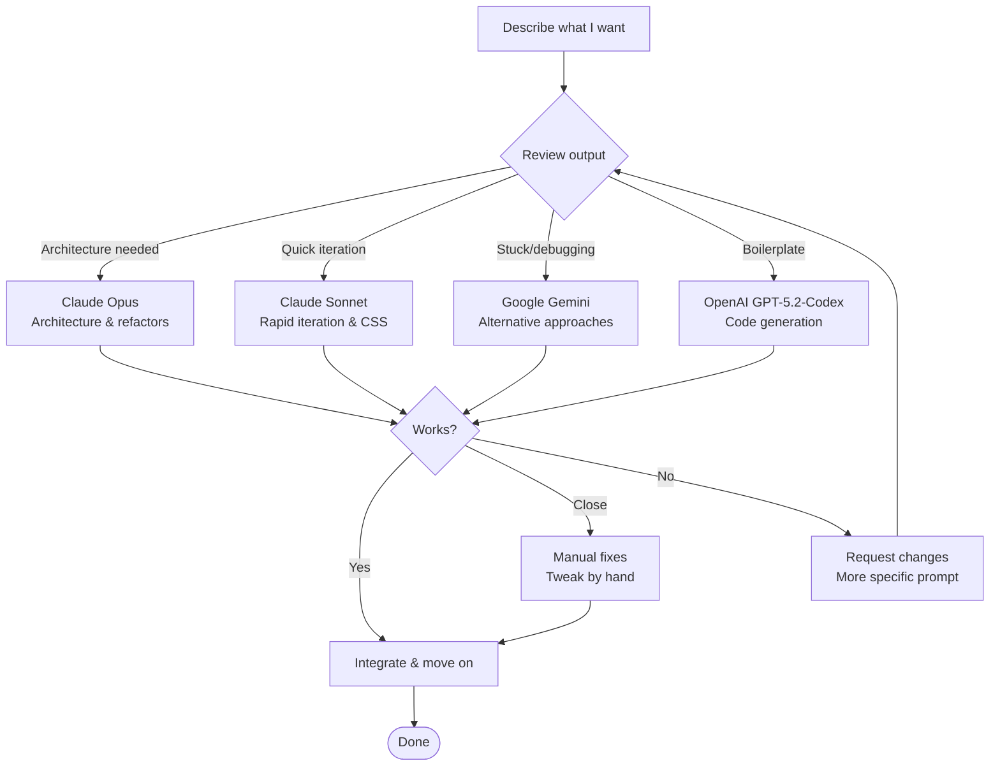

You're looking at it. I wanted to have fun with Canvas 2D rendering, experiment with Astro and TypeScript, and build a personal blog that felt "unique" - if that's still a thing..

What followed was a chaotic, iterative build session spanning a few days, some AI assistance here and there, and a lot of trial and error. Here's how it came together.

## The Stack

| Layer          | Tech                                                                                                               |
| -------------- | ------------------------------------------------------------------------------------------------------------------ |
| **Framework**  | [Astro](https://astro.build) 5.x                                                                                   |
| **Language**   | [TypeScript](https://www.typescriptlang.org) (strict mode, obviously)                                              |
| **Runtime**    | [Bun](https://bun.sh)                                                                                              |
| **Rendering**  | [HTML Canvas](https://developer.mozilla.org/en-US/docs/Web/API/Canvas_API) (no WebGL, surprisingly)                |
| **Styling**    | CSS custom properties + minimal CSS                                                                                |
| **Content**    | [MDX](https://mdxjs.com) with [Astro Content Collections](https://docs.astro.build/en/guides/content-collections/) |
| **Deployment** | [GitHub Pages](https://pages.github.com)                                                                           |

Astro was a no-brainer. Static-first, TypeScript support out of the box, and the [islands architecture](https://docs.astro.build/en/concepts/islands/) means I can drop in React components only where I need interactivity (like the settings panel).

## The ASCII Background

The star of the show is `ASCIIRenderer.ts` — a ~600 line TypeScript class that renders animated ASCII characters to a canvas element.

### How It Works

The renderer creates a grid of ASCII characters overlaid on the page using Canvas 2D API. Each character position is calculated based on:

- **Character set**: ` .:!*oe&#%@` (ordered by visual density)
- **Grid density**: Calculated from `fontSize / 2` to maintain consistent spacing
- **Frame rate**: Capped at 60fps using `requestAnimationFrame`

On each frame:

1. Clear the canvas
2. Calculate effect values for each grid position (wave displacement, matrix fall speed, pulse radius, etc.)
3. Select character based on effect value
4. Apply colour/opacity transformations
5. Render character at position

The background adapts to viewport changes via a `ResizeObserver` that recalculates grid dimensions on window resize.

### Effects

It supports multiple effects:

- **Wave**: Sine waves that respond to mouse position using `Math.sin(distance + time)` for fluid motion
- **Matrix**: Classic falling characters (white heads, fading green tails) with individual column speeds
- **Pulse**: Radiating circles from centre using distance calculations `sqrt(dx² + dy²)`
- **Glitch**: Calm noise field with scanning interference and mouse-driven colour inversion

The glitch effect went through several iterations. It started as pure random noise (jarring), then became occasional bursts (still annoying), and finally settled into what it is now: a calm base pattern with a slowly-moving scanline and the ability to "paint" with your cursor.

```typescript
// The mouse trail that makes glitch fun
private mouseTrail: { x: number; y: number; time: number }[] = [];

// Characters near the mouse get inverted colours
if (mouseDist < mouseRadius) {
  isInverted = true;
  trailBoost = (1 - mouseDist / mouseRadius) * 0.6;
}
```

### Performance

The renderer includes throttling to prevent unnecessary redraws:

- Only redraws when animation is active or settings change
- Stops animation when intensity is 0
- Uses typed arrays for position calculations where possible
- Single canvas context reused across all frames

## The "Breakthrough" Animation

When you load the homepage, the content doesn't just appear — it _breaks through_ the ASCII background. This is a two-part trick:

1. **CSS Animation**: The content scales up from 60% with a blur, using a custom easing curve
2. **Canvas Explosion**: At the same moment, an "explosion" is triggered in the renderer that pushes ASCII characters outward and clears a zone

```typescript
triggerExplosion(x: number, y: number): void {
  this.explosions.push({
    x, y,
    radius: 0,
    startTime: Date.now()
  });
}
```

The explosion expands outward, pushing characters with it, then after it reaches full size, a "recovery" phase kicks in where characters cascade back from top to bottom with a shimmer effect. It's dramatic but not _too_ dramatic.

## The Settings Panel

The settings went through a major simplification after the LLM's got involved. Originally there were custom colour pickers, multiple sliders, and way too many options. The new version uses:

- **6 preset colour themes**: Emerald, Ocean, Violet, Amber, Rose, Slate
- **5 background effects**: None, Wave, Matrix, Pulse, Glitch
- **Speed and intensity sliders**
- **An auto-cycle toggle** for the truly indecisive

Each colour theme sets both the UI accent colour (for links, buttons, active states) and the ASCII background tint. One choice, consistent look.

## AI-Assisted Development

This site was built with help from AI assistants. I'm not going to pretend otherwise — it's 2026, and AI-assisted coding is just how things work now.

An idea of my workflow:



The workflow was conversational: describe what I wanted, review the output, request changes, iterate. The AI handled the tedious parts (CSS animations, math for wave effects, TypeScript types) while I focused on the creative direction.

Some things AI did particularly well:

- Implementing the explosion/shockwave physics
- Getting the easing curves right for animations
- Fixing hydration mismatches (React + SSR is still painful)
- Suggesting the mouse trail feature for glitch

Some things that still needed human judgment:

- "Make the glitch less annoying" (subjective, required iteration)
- Overall aesthetic decisions
- Knowing when something was _done_ (enough polish vs. diminishing returns)

## What's Next

This is a personal blog, so I'll probably write posts when I feel like it. The infrastructure is here, it works well, and the ASCII characters are doing their little dance.

If you've read this far, go try the glitch effect. Move your mouse around. It's satisfying.

---

_The source for this site is at [github.com/S33G/www](https://github.com/S33G/www)_
