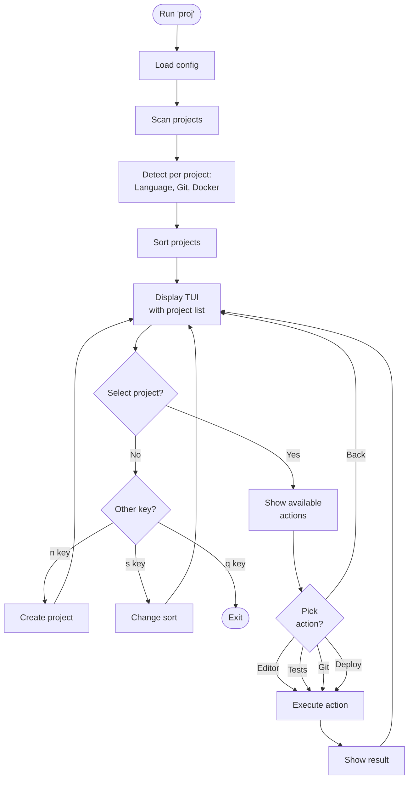

For years I've kept a small, personal tool around that does one job really well: give me a quick overview of whatever code is living on my machine right now—then let me *do something useful* with it immediately.

I finally rewrote it properly in Go and published it as `proj`:

- Repo: https://github.com/S33G/proj

The goal is simple: a portable, fast terminal UI (TUI) that scans your local code folders and helps you jump between projects and run common actions without hunting for tabs, remembering paths, or re-learning each repo's setup.

## What it’s for

If you’re like me, you’ve probably got a `~/code` (or similar) directory that slowly turns into a graveyard of:

- active work
- experiments
- half-finished ideas
- old clients / contracts
- things you swear you’ll come back to

`proj` keeps that chaos usable by providing a single place to:

- discover projects quickly (scan + list)
- see useful metadata at a glance (language, last modified, git status)
- take common actions (open in editor, run tests, install deps, git ops, docker actions)

## How it works (high level)



## Why Go

I wanted something I can drop onto any machine and get value from immediately: minimal dependencies, fast startup, and easy installation.

## Quick start

Install and run:

```bash
git clone https://github.com/s33g/proj.git
cd proj
make install

proj --init
proj --set-path ~/code
proj
```

There’s also a one-line installer in the repo if that’s more your thing:

```bash
curl -sSL https://raw.githubusercontent.com/s33g/proj/main/scripts/install.sh | bash
```

## A few things I’m excited about

- **Keyboard-driven workflow**: quick navigation, search, and actions without leaving the terminal.
- **Built-in actions**: the boring stuff is a single selection away (tests, deps, git, docker/compose).
- **Plugin system**: extend actions via JSON-RPC plugins when you need something opinionated.
- **Shell integration**: jump into a project directory directly from the TUI.

## What’s next

I’m using `proj` daily and iterating as I find friction points. If this sounds useful, give it a spin and open an issue with what you’d want it to do better.

## Contributing

Contributions are welcome—issues, feature requests, docs tweaks, and PRs all help. If you’ve got a workflow you’d love `proj` to support, open an issue with a short description of your use case and what “good” looks like.

## Coming soon

- **AI tool integrations** (OpenCode, ClaudeCode, CodexCLI, and friends)
- **Text-based workflow** (for alternate UIs / use cases—Emacs, remote shells, etc.)
- **GitHub integration** (clone repos you have access to, public or private)
- **More** as the ideas land

Thanks for reading.
