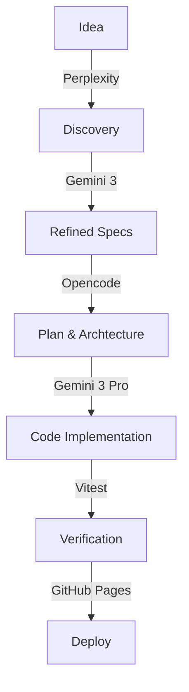

I needed a unit converter. Not one covered in ads, not one that takes five clicks to find "Joules to Calories," just a simple tool that works.

But really, I wanted to test a new development workflow.

I built [Units](https://units.s33g.uk) to see how far I could push the "AI-native" dev loop. The goal was to go from a vague idea to a shipped app using the best models available for each stage of the process.

## The Stack

- **Framework:** Next.js (App Router)
- **Language:** TypeScript
- **Styling:** Tailwind CSS
- **Testing:** Vitest

It's a standard, robust stack. Nothing exotic, which makes it perfect for testing the *process* rather than the tech.

## The Workflow

The interesting part isn't the code itself, but how it was written. I used a three-stage pipeline:

### 1. Discovery (Perplexity + Gemini 3)
I used Perplexity to generate the initial list of categories and units.

For the math, I relied on Gemini 3. It provided the explicit conversion formulas and sources for the constants, which allowed me to seed the database with verified data. This saved significant time on research and manual data entry.

### 2. Planning (Opencode / Sisyphus)
Once I knew *what* to build, I needed a plan. I used Opencode (specifically the Sisyphus agent) to break the project down into actionable tasks. We defined the architecture, the component structure, and the data models.

### 3. Implementation (Gemini 3 Pro + Sisyphus)
I used Gemini 3 Pro to write the code. It handled the React component structure and the separation of concerns for the conversion logic effectively.



## Code Spotlight: The Core Logic

The conversion logic needs to be rock solid. We decided to normalize everything to a "base unit" first, then convert to the target unit. This avoids the O(n²) complexity of defining conversion factors for every possible pair.

Here is the clean implementation `lib/convert.ts` that powers the app:

```typescript
// lib/convert.ts

// Everything goes to the base unit first (e.g., Meters, Grams, Celsius)
function unitToBase(unit: UnitDef, value: number): number {
  if (unit.toBase) return unit.toBase(value);
  if (unit.factor !== undefined) return value * unit.factor;
  throw new Error(`Unit "${unit.id}" has neither factor nor toBase`);
}

// Then from base unit to the target
function unitFromBase(unit: UnitDef, value: number): number {
  if (unit.fromBase) return unit.fromBase(value);
  if (unit.factor !== undefined) return value / unit.factor;
  throw new Error(`Unit "${unit.id}" has neither factor nor fromBase`);
}
```

This approach makes adding new units trivial—you only need to define how to get to the base unit, and the system handles the rest.

## The Result

The app is live at [units.s33g.uk](https://units.s33g.uk).

It's clean, fast, and does exactly what it says on the tin. It handles common categories (Length, Mass, Temperature) and some specific ones (Energy, Pressure).

## Contributing

The source is open at [github.com/S33G/units](https://github.com/S33G/units).

I'm welcoming contributions. If you want to add a weird unit type, fix a precision bug, or just clean up some styles, feel free to open a PR.

This project proved that the "AI-native" workflow is maturing fast. It’s no longer just about generating snippets.
