I needed a unit converter. Not one covered in ads, not one that takes five clicks to find "Joules to Calories," just a simple tool that works.

But really, I wanted to test a new development workflow.

I built [Units](https://units.s33g.uk) to see how far I could push the "AI-native" dev loop. The goal was to go from a vague idea to a shipped app using the best models available for each stage of the process.

## The Stack

- **Framework:** Next.js (App Router)
- **Language:** TypeScript
- **Styling:** Tailwind CSS
- **Testing:** Vitest

It's a standard, robust stack. Nothing exotic, which makes it perfect for testing the _process_ rather than the tech.

## The Workflow: An AI Assembly Line

The interesting part isn't the code itself, but the process. I treated LLMs not as autocomplete, but as specialised agents in a three-stage pipeline.

```mermaid
flowchart TD
    subgraph P1 [Phase 1: Discovery]
        Idea[💡 Vague Idea] -->|Perplexity| List[📋 Scope & Units]
        List -->|Gemini 3| Math[📐 Formulas & Data]
    end

    subgraph P2 [Phase 2: Architecture]
        Math -->|Opencode| Plan[📝 Sisyphus Plan]
        Plan -->|Sisyphus| Arch[🏗️ Component Specs]
    end

    subgraph P3 [Phase 3: Execution]
        Arch -->|Gemini 3 Pro| Code[💻 Implementation]
        Code -->|Vitest| Test[✅ Verification]
        Test -->|GitHub| Ship[🚀 Deploy]
    end
```



### 1. Discovery (The "What")

I started with **Perplexity** to map the territory — generating comprehensive lists of unit categories and edge cases. Then, **Gemini 3** acted as the mathematician, providing explicit conversion formulas and citing sources (like the 1959 International Yard agreement). This gave me verified constants to seed the database, skipping hours of manual data entry.

### 2. Planning (The "How")

With the requirements clear, I used **Opencode** to architect the solution. Sisyphus broke the project down into actionable tasks, defining the `UnitDef` TypeScript interfaces and component hierarchy before writing a single line of code. This "blueprint phase" is critical — it prevents the spaghetti code that usually comes from blind prompting.

### 3. Execution (The "Build")

**Gemini 3 Pro** handled the heavy lifting. Because the planning phase established strict boundaries (separation of concerns), the generated code was modular and testable from the start. **Vitest** verified the conversion logic, and the app went straight to production.

## Code Spotlight: The Core Logic

The conversion logic needs to be rock solid. We decided to normalise everything to a "base unit" first, then convert to the target unit. This avoids defining conversion factors for every possible pair — with n units, that would be n² definitions instead of just n.

Here is the clean implementation `lib/convert.ts` that powers the app:

```typescript
// lib/convert.ts

// Everything goes to the base unit first (e.g., Meters, Grams, Celsius)
function unitToBase(unit: UnitDef, value: number): number {
  if (unit.toBase) return unit.toBase(value);
  if (unit.factor !== undefined) return value * unit.factor;
  throw new Error(`Unit "${unit.id}" has neither factor nor toBase`);
}

// Then from base unit to the target
function unitFromBase(unit: UnitDef, value: number): number {
  if (unit.fromBase) return unit.fromBase(value);
  if (unit.factor !== undefined) return value / unit.factor;
  throw new Error(`Unit "${unit.id}" has neither factor nor fromBase`);
}
```

This approach makes adding new units trivial — you only need to define how to get to the base unit, and the system handles the rest.

## The Result

The app is live at [units.s33g.uk](https://units.s33g.uk).

It's clean, fast, and does exactly what it says on the tin. It handles common categories (Length, Mass, Temperature) and some specific ones (Energy, Pressure).

## Contributing

The source is open at [github.com/S33G/units](https://github.com/S33G/units).

I'm welcoming contributions. If you want to add a weird unit type, fix a precision bug, or just clean up some styles, feel free to open a PR.

This project proved that the "AI-native" workflow is maturing fast. It’s no longer just about generating snippets.
